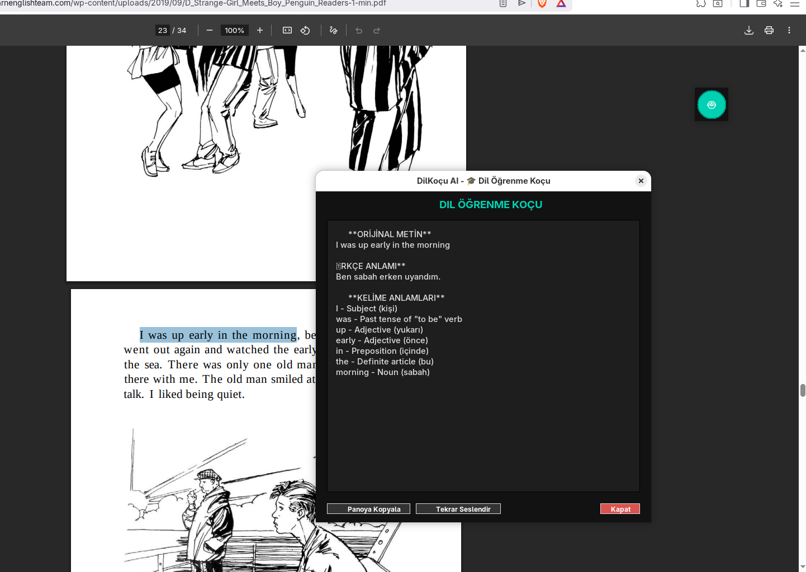

# DilKoçu AI - Akademik Dil Öğrenme Koçu

<div align="center">



`Local AI + TTS + Deep Learning = Akıllı Dil Öğrenme Deneyimi`

[](https://docs.ollama.com/quickstart)
[](https://github.com/u-asil)

</div>

---

## 📖 Proje Hakkında
Bu proje, **Dr. Ufuk Asıl** tarafından geliştirilen "AI Asistan Kampüsü" projesi temel alınarak fork edilmiş ve üzerinde kapsamlı geliştirmeler yapılarak bir **"Dil Öğrenme Koçu"** haline getirilmiştir. 

DilKoçu AI, bilgisayarınızda (PDF, Word, Tarayıcı vb.) seçtiğiniz herhangi bir metni tek bir tıklamayla (**🤖 AI Butonu**) veya kısayol tuşuyla (**Shift + Alt + G**) analiz eder, sesli telaffuz eder ve size o metnin gramer yapısını öğreten bir asistan vazifesi görür.

---

## ✨ Yeni ve Gelişmiş Özellikler

### 🎓 1. Dil Öğrenme Koçu (Sade ve Hızlı Analiz)
Gereksiz detaylardan arındırılmış, doğrudan öğrenmeye odaklanan yeni analiz yapısı:
- **Orijinal Metin:** Seçilen metnin temiz ve okunaklı hali.
- **Türkçe Anlamı:** Metnin en doğal ve akıcı Türkçe karşılığı.
- **Kelime-Kelime Anlam:** Cümledeki her kelimenin tek tek Türkçe karşılığını gösteren sözlük yapısı.

### 🔊 2. Akıllı Seslendirme (Neural TTS)
- **Doğal Telaffuz:** Dil Koçu modunda metni yüksek kaliteli İngilizce aksanıyla otomatik olarak seslendirir.
- **Tekrar Dinleme:** Analiz ekranındaki buton sayesinde telaffuzu istediğiniz kadar tekrar dinleyerek pratik yapabilirsiniz.

---

## 🦙 Ollama Kurulumu (Yerel Yapay Zeka)

DilKoçu AI'nın yerel olarak çalışabilmesi ve hızlı analiz yapabilmesi için bilgisayarınızda **Ollama** yüklü olmalıdır.

### 1. Ollama'yı Kurun
- **Linux & macOS:** Terminali açın ve şu komutu çalıştırın:
  ```bash
  curl -fsSL https://ollama.com/install.sh | sh
  ```
- **Windows:** [ollama.com](https://ollama.com/download/windows) adresinden Windows kurulum dosyasını indirip çalıştırın.

### 2. Modeli İndirin ve Çalıştırın (Gemma 3:1B)
Programın beyni olarak çalışan modeli indirmek ve test etmek için terminale şu komutu yazın (bu komut hem indirmeyi hem de başlatmayı sağlar):
```bash
ollama run gemma3:1b
```

---

## 🚀 Kurulum ve Başlatma

Programın çalışması için gerekli kütüphaneler bir sanal ortamda (`.venv`) tutulmaktadır. Doğrudan `python3 main.pyw` komutu hata verecektir.

### 🐧 Linux İşlemleri
1. **Bağımlılıkları Kurun:**
   ```bash
   bash kurulum.sh
   ```
2. **Programı Başlatın:**
   Sanal ortamı aktif ederek çalıştırmanız gerekir:
   ```bash
   source .venv/bin/activate
   python main.pyw
   ```
   *Veya alternatif olarak:* `./.venv/bin/python main.pyw`

### 🪟 Windows İşlemleri
1. `kurulum.bat` dosyasını çalıştırın.
2. `BASLAT.bat` dosyasını çalıştırarak uygulamayı açın (Bu dosya sanal ortamı otomatik kullanır).

---

## 🔧 Kullanım Rehberi

1. Herhangi bir doküman (PDF, Kitap, Web Sayfası vb.) açın.
2. Öğrenmek istediğiniz metni seçin.
3. Ekranda yüzen **🤖 AI Butonuna** tıklayın (veya **Shift + Alt + G** tuşlarına basın).
    - *Not: Linux Fedora/Wayland gibi kullanıcıları için yüzen buton en güvenilir yöntemdir.*
    - *Butonu farenizle istediğiniz yere sürükleyebilirsiniz.*
4. Açılan menüden **"🎓 Dil Öğrenme Koçu"** veya diğer AI modlarını seçin.

---

## 🆘 Sorun Giderme

### `ModuleNotFoundError: No module named 'pyperclip'`
Bu hata, sanal ortamı (`.venv`) aktif etmediğinizde oluşur. Lütfen yukarıdaki "Başlatma" adımlarını takip edin: `source .venv/bin/activate`

### `sudo: apt-get: command not found`
Eğer `kurulum.sh` çalışırken bu hatayı alıyorsanız, sisteminiz Ubuntu/Debian tabanlı değildir. Kendi paket yöneticinizle şu paketleri kurun:
- **Fedora:** `sudo dnf install python3-tkinter espeak`
- **Arch:** `sudo pacman -S tk espeak-ng`

---

## 🛠️ Teknoloji Yığını
- **Shortkey:** Shift + Alt + G (Global) / Yüzen AI Butonu
- **Intelligence:** Ollama (Local LLM) / Google Gemini
- **Voice:** `gTTS` (Neural TTS - Yüksek Kalite)
- **Audio Engine:** `Pygame` & System Players
- **GUI:** `Tkinter` (Custom Dark Design)

---

## 🤝 Teşekkür
Bu projenin temellerini atan ve fikir babası olan **Dr. Ufuk Asıl**'a katkılarından dolayı teşekkür ederiz. Orijinal projeye [buradan](https://github.com/ufukasia/Introduction-to-Data-Visualization-Project-Assignment) ulaşabilirsiniz.
